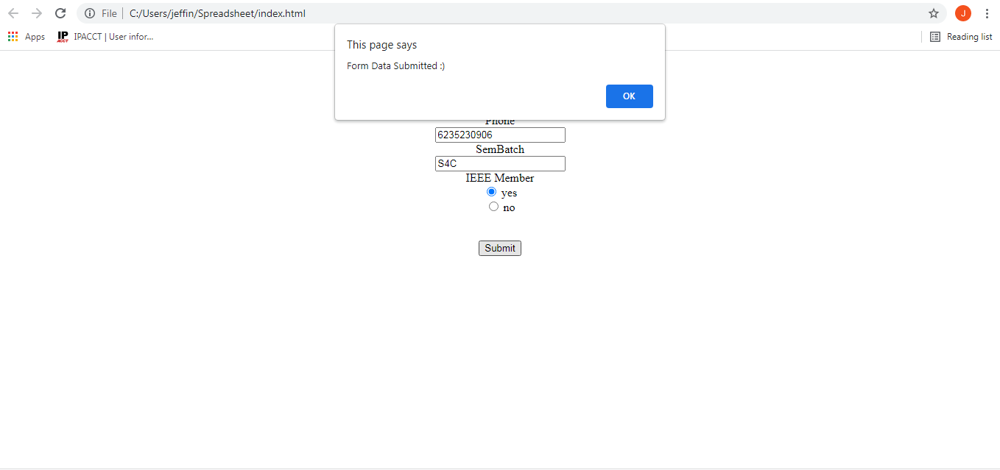
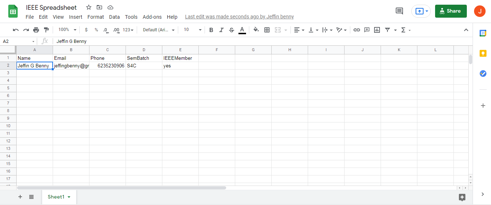

## HtmlFormToGoogleSheet
## Google Sheet link:  https://docs.google.com/spreadsheets/d/1N9Aux1UMNsbZfmJt3Y8W9h5br1Juwy9ujY4rzql66t4/edit?usp=sharing
## Steps performed
1. Basic form was created using html
2. A blank spreadsheet to which th data is to be sent  was created.
3. APISpreadsheets was used to get the api for the google sheet.
4. Javascript and Ajax were used to configure  and send data to the spreadsheet.

## Screenshots

